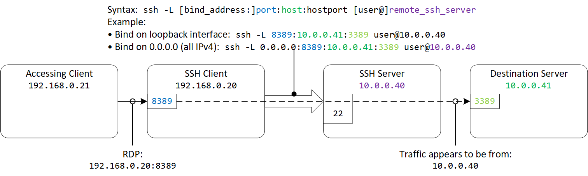
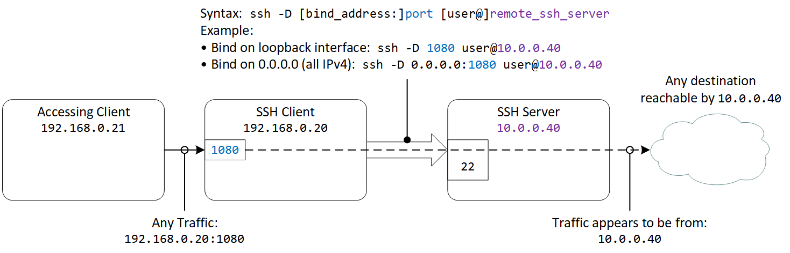
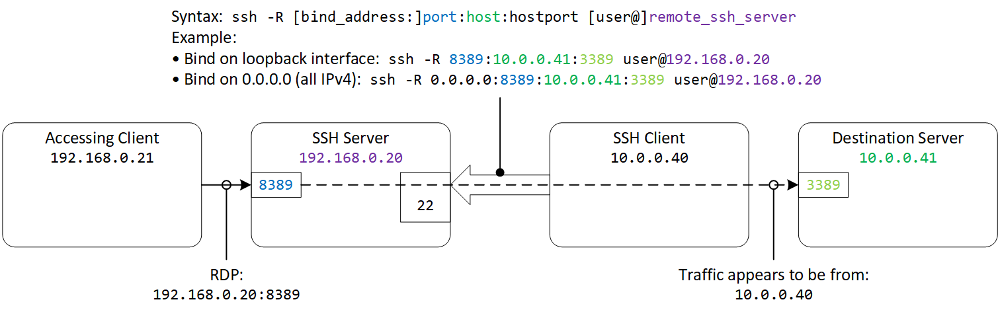
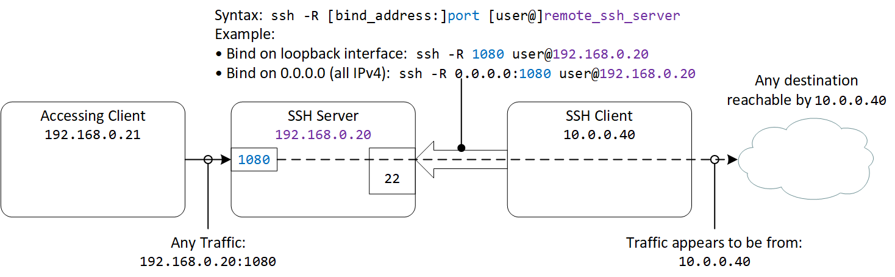

# SSH Port Forwarding and ProxyChains

# 1. Forward Tunnels

## 1.1. Forward Single-port Tunnel
- Syntax:
```console
ssh -L [bind_address:]port:host:hostport [user@]remote_ssh_server
```
- Example - Bind on loopback interface:
```console
ssh -L 8389:10.0.0.41:3389 user@10.0.0.40
```
- Example - Bind on 0.0.0.0 (all IPv4):
```console
ssh -L 0.0.0.0:8389:10.0.0.41:3389 user@10.0.0.40
```


## 1.2. Forward Multi-port (Dynamic) Tunnel (a.k.a. forward SOCKS proxy)
- ☝️ a.k.a. Dynamic (`-D`) port forwarding
- Syntax:
```console
ssh -D [bind_address:]port [user@]remote_ssh_server
```
- Example - Bind on loopback interface:
```console
ssh -D 1080 user@10.0.0.40
```
- Example - Bind on 0.0.0.0 (all IPv4):
```console
ssh -D 0.0.0.0:1080 user@10.0.0.40
```


# 2. Reverse Tunnels
### ☝️ For remote port forwarding:
- By default, the listening socket on the server can only bind to the `lo` loopback interface (`127.0.0.1`)
- Set `GatewayPorts yes` in the server's `sshd_config` to enable binding to other interfaces
```console
sed -i 's/#GatewayPorts no/GatewayPorts yes/' /etc/ssh/sshd_config
```

## 2.1. Reverse Single-port Tunnel
- Syntax:
```console
ssh -R [bind_address:]port:host:hostport [user@]remote_ssh_server
```
- Example - Bind on loopback interface:
```console
ssh -R 8389:10.0.0.41:3389 user@192.168.0.20
```
- Example - Bind on 0.0.0.0 (all IPv4):
```console
ssh -R 0.0.0.0:8389:10.0.0.41:3389 user@192.168.0.20
```


## 2.2. Reverse Multi-port (Dynamic) Tunnel (a.k.a. reverse SOCKS proxy)
- Syntax:
```console
ssh -R [bind_address:]port [user@]remote_ssh_server
```
- Example - Bind on loopback interface:
```console
ssh -R 1080 user@192.168.0.20
```
- Example - Bind on 0.0.0.0 (all IPv4):
```console
ssh -R 0.0.0.0:1080 user@192.168.0.20
```


# 3. ProxyChains
- Consider the last scenario in 2.2.:
  - The accessing client `192.168.0.21` does not have a route to the `10.0.0.0/24` network
  - The initial breach to the host `10.0.0.40` managed to establish a reverse dynamic tunnel and now have a SOCKS proxy on `192.168.0.20:1080`
- ProxyChains can be used to chain any commands on the accessing client to use the SOCK proxy
- Edit the ProxyChains configuration file at `/etc/proxychains4.conf`
```console
vi /etc/proxychains4.conf
```
- The default ProxyList configuration sets to "tor"
```console
[ProxyList]
# add proxy here ...
# meanwile
# defaults set to "tor"
socks4  127.0.0.1 9050
```
- Replace the proxy configuration to the SOCKS proxy created in 2.2.
```console
[ProxyList]
# add proxy here ...
# meanwile
# defaults set to "tor"
# socks4  127.0.0.1 9050
socks5  192.168.0.20 1080
```
- Prepend commands targeted for `10.0.0.0/24` with `proxychains`
```console
proxychains nmap -sS -sV 10.0.0.0/24
```
